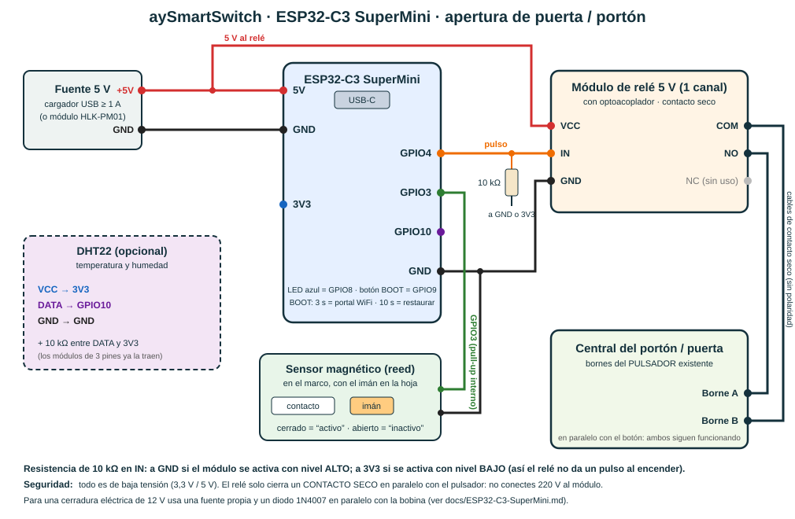

# aySmartSwitch con ESP32-C3 SuperMini — control de apertura de puertas y portones



La placa **ESP32-C3 SuperMini** (4 MB, WiFi, USB-C nativo) corre el mismo firmware v2 que el ESP32-WROOM-32.
Se programa una sola vez por USB; después se adhiere desde la app como cualquier otro equipo y se actualiza
sola por internet (OTA firmada).

## Materiales

| Cantidad | Elemento | Nota |
|---|---|---|
| 1 | ESP32-C3 SuperMini | |
| 1 | Módulo de relé 5 V de 1 canal **con optoacoplador** | contacto seco (COM / NO / NC) |
| 1 | Fuente de 5 V, 1 A | cargador USB o módulo HLK-PM01 en caja cerrada |
| 1 | Sensor magnético (reed) NA | opcional: informa si el portón está cerrado |
| 1 | Resistencia 10 kΩ | en la entrada IN del relé (ver más abajo) |
| — | Cable, borneras, caja plástica | |
| 1 | DHT22 + 10 kΩ | opcional (temperatura y humedad) |

## Pines (los que la app deja asignar en esta placa)

| Uso | GPIO | Notas |
|---|---|---|
| Relé / salidas | **4** (por defecto), 0, 1, 3, 5, 6, 7, 10 | |
| Entradas (sensor, pulsador) | **3** (por defecto), 0, 1, 4, 5, 6, 7, 10 | con pull-up interno |
| Analógica (0–3,3 V) | 0, 1, 3, 4 | ADC1; el ADC2 (GPIO5) no sirve con WiFi |
| DHT22 | **10** (por defecto) | |
| **Reservados** | 2, 8, 9, 18, 19, 20, 21 | 2/8/9 son de arranque (8 = LED, 9 = botón BOOT); 18/19 = USB; 20/21 = UART0 |

El servidor rechaza cualquier otro pin, y rechaza adherir un equipo cuya placa no coincide con la del instrumento.

## Conexión (ver el esquema)

1. **Alimentación:** fuente 5 V → pin `5V` y `GND` de la placa. No conectes el USB del PC y la fuente de 5 V al mismo tiempo
   (usa un solo origen de energía).
2. **Relé:** `VCC` → 5 V · `GND` → GND · `IN` → **GPIO4**.
   - Resistencia de **10 kΩ** entre `IN` y **GND** si el módulo se activa con nivel ALTO, o entre `IN` y **3V3** si se activa
     con nivel BAJO (la mayoría de los módulos azules). Evita que el relé dé un pulso al encender o reiniciar.
3. **Portón:** los bornes `COM` y `NO` del relé van **en paralelo con el pulsador** de la central del portón (los dos bornes
   donde ya está conectado el botón o el control remoto). El relé solo simula una pulsación; el botón original sigue funcionando.
4. **Sensor de estado (opcional):** un terminal del reed → **GPIO3**, el otro → **GND**. El imán va en la hoja del portón
   y el sensor en el marco. Contacto cerrado (imán cerca) = canal **activo**; si tu montaje es al revés, marca
   *Lógica invertida* en la función.

### Cerradura eléctrica de 12 V (en vez de la central de un portón)

El relé no puede alimentar la cerradura desde los 5 V de la placa. Usa una **fuente de 12 V propia**:
`+12 V → COM`, `NO → cerradura (+)`, `cerradura (−) → − de la fuente`. Pon un **diodo 1N4007** en paralelo con la bobina
(cátodo, la raya, hacia el +) para proteger el contacto. Revisa que el relé soporte la corriente de la cerradura.

> **Seguridad:** todo el montaje es de baja tensión. No conectes 220 V al módulo de relé; para motores o cerraduras de red
> usa la entrada de pulsador de su central o un contactor certificado, dentro de una caja cerrada.

## Programar la placa (una vez, por USB)

```bash
pio run -e c3mini -t upload --upload-port COMx      # COMx = el puerto que aparece al conectar la placa
```

La placa se ve como *Dispositivo serie USB (COMx)*. Si no aparece: mantén pulsado **BOOT** mientras la conectas
(modo descarga) y vuelve a intentar. El monitor serie usa 115 200 baudios.

## Probar con el cable USB (consola de diagnóstico)

Abre el monitor serie (`pio device monitor -b 115200`) y escribe `ayuda`:

| Comando | Para qué sirve |
|---|---|
| `estado` | versión, placa, id del equipo, WiFi, servidor, memoria |
| `canales` | relés y sensores configurados con su estado |
| `salida 4 500` | pulso de prueba de 500 ms en el GPIO4 → el relé debe hacer **clic** y encender su LED |
| `escuchar 3 20` | vigila el GPIO3 20 s y muestra cada cambio → acerca y aleja el imán del sensor |
| `led` | parpadea 3 veces el LED azul de la placa |
| `wifi` | lista las redes WiFi visibles |
| `wifi MiRed\|clave` | guarda el WiFi y reinicia (alternativa al portal del celular) |
| `codigo ABCD-EFGH` | guarda el código de adhesión |
| `rele 0 pulso` | acciona el canal 0 una vez adherido |
| `portal`, `reiniciar`, `fabrica confirmar` | abrir el portal, reiniciar, restaurar de fábrica |

## Dar de alta el equipo

1. En la app **aySmartSwitch → Instrumentos → Nuevo**: elige la placa **ESP32-C3 SuperMini**, la plantilla
   **Portón o puerta (relé + sensor de estado)** y el cliente. Los pines (relé 4, sensor 3) ya vienen puestos.
   Ajusta el pulso (500 ms es lo normal) y marca **Módulo activo en bajo** si tu relé enciende con nivel bajo.
2. Pulsa **Adherir equipo** → aparece un código `ABCD-EFGH` válido 24 h.
3. Energiza la placa. Desde el celular conéctate a la red **`AySmartSwitch-XXXX`** (clave = últimos 8 dígitos de la MAC, que el
   equipo escribe por el puerto serie al arrancar), elige tu WiFi, escribe su clave y el código.
4. En unos segundos el instrumento aparece **En línea** y el botón del panel abre el portón.

## Si algo no anda

| Síntoma | Causa probable |
|---|---|
| El relé se activa al revés (queda activo y se suelta al pulsar) | falta *Módulo activo en bajo* en la función |
| El relé da un golpe al encender | falta la resistencia de 10 kΩ en `IN` |
| El panel muestra el portón "cerrado" cuando está abierto | marca *Lógica invertida* en el sensor |
| No aparece el puerto COM | cable solo de carga, o modo descarga (BOOT al conectar) |
| LED parpadeo rápido | portal abierto · lento: sin WiFi · muy lento: sin servidor |
| "Este equipo es un …, pero el instrumento está configurado para …" | la placa elegida en la app no es la que estás adhiriendo |

## Confirmación de cada comando (efectividad de la red)

Cada comando que sale de la app queda registrado con su identificador y recorre este camino:

1. el servidor lo publica y anota la hora de salida;
2. el equipo lo recibe, **lee de vuelta el pin del relé** para comprobar que el chip lo llevó al nivel pedido (detecta un
   pin en corto o dañado; no prueba que los contactos del relé se hayan cerrado: para eso sirve el sensor del portón) y responde;
3. al terminar el pulso vuelve a leer el pin y confirma que regresó al reposo;
4. el servidor mide la **ida y vuelta** (salida → respuesta) y marca el comando como *confirmado*, *sin respuesta* (15 s),
   *rechazado*, *expirado* o *fallo del pin*.

En la app, **Métricas** del instrumento muestra la tasa de comandos confirmados, el tiempo de ida y vuelta (mediana, promedio,
p95 y máximo), los fallos de pin y los últimos comandos. Por serie, `rele 0 pulso` y `salida 4 500` muestran la lectura real del pin.
